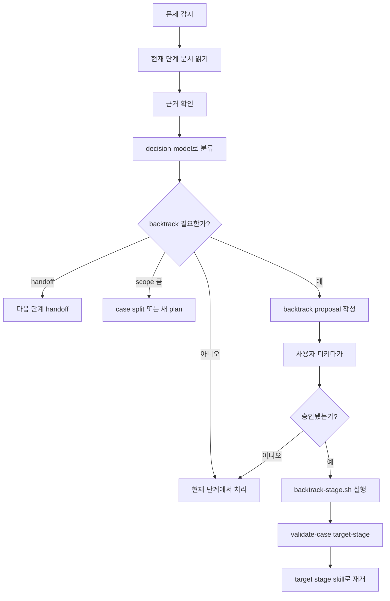

# SDLC Backtrack Workflow

이 문서는 `sdlc-backtrack`의 판단 흐름을 정의한다.

Backtrack은 stage가 아니라 orchestration이다. 목표는 현재 단계에서 억지로 결정을
밀어붙이지 않고, 책임 있는 앞 단계로 짧게 돌아가 질문을 닫는 것이다.

## Pipeline Diagram



## 입력

일반적으로 다음을 읽는다.

- `README.md`
- `metadata.yaml`
- 현재 stage의 `result.md`와 `handoff.md`
- backtrack 대상 stage의 `result.md`와 `handoff.md`

필요할 때만 다음을 추가로 읽는다.

- backtrack을 유발한 source, test, log, spec, PR diff
- `evidence.md`
- target 이후 downstream stage의 `result.md`와 `handoff.md`
- 관련 role reference 또는 stage skill reference

## Proposal

Backtrack proposal은 사용자와 논의하기 위한 임시 산출물이다.

반드시 다음을 담는다.

- 현재 stage와 target stage
- backtrack을 제기한 근거
- 근거가 타당한지에 대한 판단
- 닫아야 할 질문 1개
- 가능한 선택지 2-3개
- 추천 방향
- downstream에서 다시 봐야 할 문서와 변경 가능성
- backtrack하지 않을 때의 대안

Proposal은 `.agents/runs/sdlc-backtrack/<case-id>/` 아래에 둔다.

## 티키타카

Agent는 backtrack이 필요하다고 단정하지 않는다.

먼저 근거를 확인하고, 현재 단계에서 처리할 수 있는 문제인지 분리한다. 사용자에게는
선택지를 짧게 제시하고, 이번 loop에서 닫을 질문을 좁힌다.

질문이 여러 개면 가장 앞선 책임 단계와 가장 작은 질문으로 줄인다.

## 승인 후 실행

사용자가 승인하면 core script를 실행한다.

```bash
.agents/sdlc/core/scripts/backtrack-stage.sh <case-id> <target-stage> \
  --reason "<reason>" \
  --question "<question>"
```

그 다음 target stage를 검증한다.

```bash
.agents/sdlc/core/scripts/validate-case.sh <case-id> <target-stage>
```

이후 target stage skill을 사용해 승인된 질문을 닫는다.

## 금지 사항

- 승인 없이 lifecycle status를 바꾸지 않는다.
- downstream 산출물을 삭제하지 않는다.
- backtrack proposal을 공식 stage decision처럼 취급하지 않는다.
- target stage에서 전체 설계를 다시 여는 식으로 scope를 확대하지 않는다.
