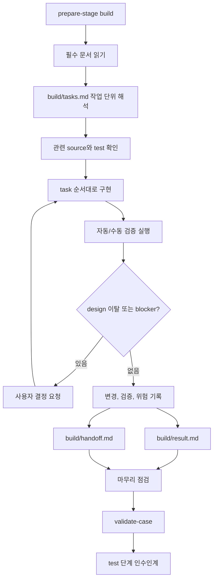

# SDLC Build Workflow

이 문서는 `sdlc-build` 단계의 판단 흐름을 정의한다. 공통 lifecycle은
`.agents/sdlc/core`를 따른다.

## 목적

Build 단계는 설계를 실제 변경으로 구현하고, test 단계가 검증할 수 있는 증거를 남기는
단계다.

Build 단계의 기본 전제는 Agent가 잘 정의된 task의 1차 구현자가 되고, Engineer가 방향
제시자와 reviewer로 남는 것이다. Agent는 기계적인 wiring과 반복 구현을 맡지만,
scope, architecture, domain risk, long-term maintainability 판단은 사람이 소유한다.

좋은 build 산출물은 다음 단계 작업자가 대화 기록 없이 다음을 이해하게 만든다.

- 어떤 task를 구현했는가
- 어떤 파일과 contract가 바뀌었는가
- 어떤 design 결정과 guardrail을 보존했는가
- 어떤 검증을 실행했고 결과가 무엇인가
- 어떤 검증을 못 했고 남은 위험은 무엇인가
- test 단계가 무엇을 우선 검증해야 하는가

## Pipeline Diagram

## 입력

반드시 읽는 입력은 `prepare-stage.sh <case-id> build`의 출력이 정한다.

일반적으로 다음 문서를 읽는다.

- `README.md`
- `metadata.yaml`
- `design/result.md`
- `design/handoff.md`
- `build/tasks.md`

필요할 때만 다음을 추가로 읽는다.

- `evidence.md`
- 관련 source file
- 관련 test file
- 관련 `docs/` 또는 internal contract 문서
- 이전 build, test, review 산출물

## Task 실행 원칙

- `build/tasks.md`의 의존성 순서를 기본으로 따른다.
- 먼저 contract, shared API, schema, config처럼 downstream을 막는 작업을 처리한다.
- 한 task의 변경이 다른 task를 암묵적으로 완료하면 `build/result.md`에 그 관계를 기록한다.
- task가 너무 커지면 build 결과에서 실제 변경 조각과 검증 범위를 나눠 설명한다.
- task가 더 이상 필요 없어지면 제거 이유를 기록한다. case 목표를 바꾸지는 않는다.
- 명확한 task는 Agent가 first-pass implementation을 작성한다.
- 모호한 요구사항, 새 abstraction, cross-cutting architecture는 사용자 결정으로 올린다.

## Agentic Build Loop

Agent는 implementation을 한 번 작성하고 끝내지 않는다.

- `AGENTS.md`, local docs, 기존 test pattern을 먼저 확인한다.
- 코드 검색으로 기존 convention과 historical quirk를 찾는다.
- boilerplate는 기존 error handling, telemetry, security wrapper, style pattern에 맞춘다.
- build, lint, test 오류가 나오면 scope 안에서 수정하고 다시 검증한다.
- 명령 실행 실패가 환경 문제인지 구현 문제인지 구분해 기록한다.
- 구현과 함께 test 또는 manual validation 절차를 작성한다.
- 요청받으면 PR message 후보와 diff-ready changeset 요약을 남긴다.

## Delegate Review Own

Build 단계의 업무 분담은 다음 기준을 따른다.

- `Delegate`: scaffolding, CRUD, wiring, boilerplate, refactor, test 초안처럼 명세가 명확한 일
- `Review`: design choice, performance, security, migration risk, domain alignment
- `Own`: 새 abstraction, ambiguous product requirement, architecture tradeoff, 장기 유지보수성

Agent는 `Delegate` 영역을 적극적으로 구현한다. `Review`와 `Own` 영역은 산출물에 근거와
우려를 남기고, 필요한 경우 사용자 결정을 요청한다.

## Design 이탈 처리

구현 중 design과 다른 방향이 필요하면 즉시 분리한다.

- `blocker`: build를 계속할 수 없는 결정이다. 사용자에게 묻는다.
- `design-backtrack`: design 결정 자체를 바꿔야 한다. design 보정 또는 사용자 승인이 필요하다.
- `test-handoff`: 구현은 가능하지만 test 단계에서 검증해야 하는 위험이다.
- `release-concern`: backport, rollout, 문서화, 운영 확인으로 넘길 위험이다.

이탈을 source 변경으로 먼저 밀어붙이지 않는다.

`design-backtrack`이면 현재 build를 계속 진행하지 않는다. 사용자에게 되돌릴 단계,
되돌리는 이유, 닫아야 할 질문 1개를 제시하고 승인되면 core `stage-backtrack.md`를
따른다.

## 검증

각 task는 자동 또는 수동 검증 기준을 가져야 한다.

검증 기록에는 다음을 남긴다.

- 실행한 명령
- 결과
- 실패한 명령과 원인
- 실행하지 못한 명령과 이유
- 수동 검증 절차
- test 단계가 반복해야 할 regression 범위

## 출력

Build 단계는 다음 문서를 작성한다.

- `build/result.md`
- `build/handoff.md`

`build/result.md`는 구현 결과, 변경 파일, task별 상태, 검증 결과, 남은 위험을 기록한다.

`build/handoff.md`는 test 단계의 읽을 문서, 검증 우선순위, 금지 사항, 완료 조건을 적는다.

Root `README.md`와 `metadata.yaml`은 build 결정 또는 open decision이 바뀔 때만 갱신한다.

## 마무리 기준

Build 단계는 다음 조건을 만족해야 마무리할 수 있다.

- 모든 build task가 완료, 제외, 또는 다음 단계 인수인계로 처분됐다.
- source 변경과 design 결정의 trace가 있다.
- 검증 명령과 결과가 기록됐다.
- 실패 또는 미실행 검증이 숨겨져 있지 않다.
- test 단계가 대화 기록 없이 검증을 시작할 수 있다.
