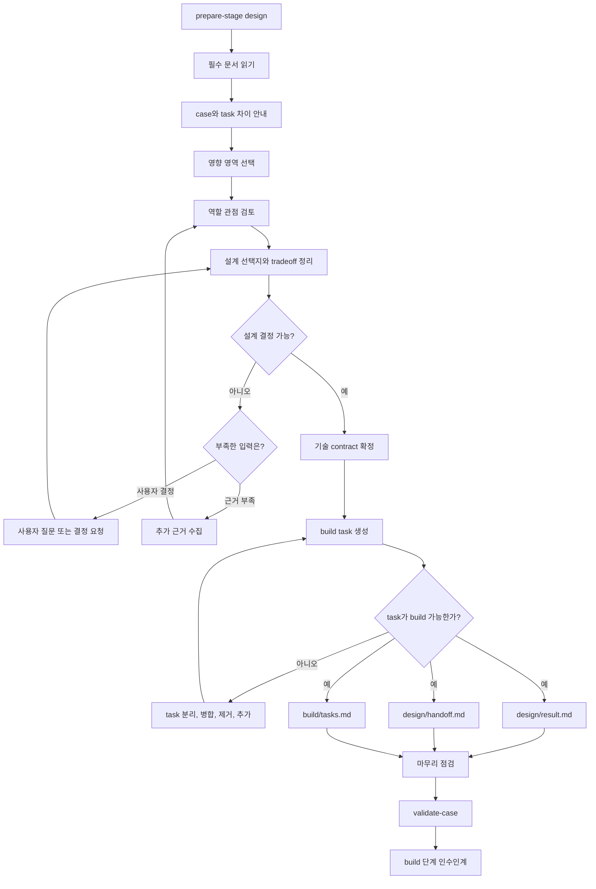

# SDLC Design Workflow

이 문서는 `sdlc-design` 단계의 판단 흐름을 정의한다. 공통 lifecycle은
`.agents/sdlc/core`를 따른다.

## 목적

Design 단계는 계획을 구현 가능한 기술 설계로 바꾸는 단계다.

좋은 design 산출물은 build 작업자가 대화 기록 없이 다음을 이해하게 만든다.

- 무엇을 구현해야 하는가
- 어떤 기술 결정을 이미 확정했는가
- 어떤 대안을 검토했고 왜 제외했는가
- 어떤 contract, data flow, control flow를 지켜야 하는가
- 어떤 작업 단위와 의존성으로 구현해야 하는가
- 어떤 품질, 접근성, 보안, 운영 기준을 만족해야 하는가
- plan에서 승인된 case/PR 경계를 벗어나지 않는가

## Pipeline Diagram

## Case와 Task

Design 단계는 task를 만들기 전에 case와 task의 차이를 먼저 안내한다.

- `case`는 승인된 SDLC 작업의 공식 컨테이너다. 문제, 목표, 범위, 근거, 결정,
  stage lifecycle을 담고 plan부터 release까지 이어진다.
- `task`는 하나의 case 안에서 build가 실행할 구현 단위다. design 결정에 따라
  만들어지며, 구체적인 변경 범위, 의존성, 검증 기준, 제외 범위를 가진다.

간단히 말하면 case는 “왜 이 일을 하는가와 무엇을 달성해야 하는가”를 답하고,
task는 “그 목표를 구현하기 위해 어떤 조각을 어떤 순서로 바꿀 것인가”를 답한다.

Task는 case를 대체하지 않는다. Task는 case 목표와 design 결정에 trace되어야 하며,
task 안에서 제품 목표나 scope를 다시 정의하지 않는다.

Plan에서 승인된 case는 기본적으로 하나의 PR 경계를 가진다. Design은 이 경계를
존중한다. 여러 PR이 필요해 보이면 build task를 쪼개는 것으로 해결하지 말고,
case split 재검토가 필요한 concern으로 기록한다.

## 입력

반드시 읽는 입력은 `prepare-stage.sh <case-id> design`의 출력이 정한다.

일반적으로 다음 문서를 읽는다.

- `README.md`
- `metadata.yaml`
- `plan/result.md`
- `plan/handoff.md`

필요할 때만 다음을 추가로 읽는다.

- `evidence.md`
- backtrack을 유발한 downstream stage의 `result.md`와 `handoff.md`
- 관련 source file
- 관련 `docs/` 문서
- design system, component library, UI mockup, image, Figma/MCP 자료
- 이전 SDLC case의 design 또는 build 산출물

## 커버해야 하는 영역

모든 case가 모든 영역을 필요로 하지는 않는다. plan handoff, evidence, source 근거를
보고 필요한 영역만 선택한다.

- 제품과 UX: 사용자 flow, 대안, edge case, 접근성, 고객 검증 기준
- 프론트엔드: routing, state, component map, design token, typed props, API 사용
- 백엔드: endpoint, DTO, service boundary, transaction, authorization, audit
- 코어와 도메인: shared module, policy engine, backward compatibility, invariants
- 데이터: schema, migration, index, retention, privacy, reporting impact
- 인프라와 운영: config, secret, deployment, feature flag, rollback, observability
- 보안과 위험: trust boundary, spoofing, permission, data exposure, abuse case
- QA와 릴리스: automated/manual test matrix, release train, backport, monitoring

## Delegate, Review, Own

사용자의 참고 의견을 다음 책임 구분으로 적용한다.

### Delegate

Agent가 빠르게 초안을 만들 수 있는 일이다.

- boilerplate, component stub, prototype sketch
- design token 또는 style guide 적용 초안
- codebase flow와 edge case 탐색
- 대안 설계 비교표
- API contract draft와 typed props 초안

초안은 final decision이 아니다. production source를 수정해야 하면 사용자 승인을 받는다.

### Review

팀 또는 담당자가 검토해야 하는 일이다.

- 기존 architecture와 design system convention 준수 여부
- 접근성, 품질, 보안, 운영 기준 충족 여부
- 기존 system과 integration 가능성
- prototype과 실제 구현 사이의 차이
- testability와 rollout 가능성

### Own

사람이 최종 소유하는 결정이다.

- 최종 UX 방향과 design system 규칙
- 핵심 architecture pattern
- trust boundary, authorization, data privacy
- release scope와 customer-facing tradeoff
- 확정 build scope와 제외 범위

## 설계 대화

질문은 한 번에 많이 던지지 않는다. build를 시작하기 위해 닫아야 하는 질문부터 묻는다.

Backtrack으로 다시 열린 design이면 승인된 backtrack 질문 1개를 먼저 닫는다. 그
질문을 닫는 데 필요하지 않은 설계 재검토나 task 확장은 새 scope로 분리한다.

대안을 제시할 때는 보통 2-3개로 제한한다.

- 추천안
- 낮은 위험안
- 빠른 검증안 또는 장기 확장안

각 대안은 장점, 비용, 위험, 제외해야 할 조건을 함께 적는다.

설계 결정이 가능하지 않으면 바로 contract를 확정하지 않는다. 부족한 것이 사용자
결정이면 질문하고, 근거 부족이면 source나 문서를 더 확인한 뒤 선택지로 돌아간다.

Task가 build 가능한 수준인지도 별도로 확인한다. task가 너무 크거나, 검증 기준이
없거나, case 목표와 trace되지 않으면 task를 분리, 병합, 제거, 추가한다.

## 출력

Design 단계는 다음 문서를 작성한다.

- `design/result.md`
- `design/handoff.md`
- `build/tasks.md`

`design/result.md`는 확정된 기술 결정과 열린 결정을 분리한다. 열린 결정은
`blocker`, `build-handoff`, `case-wide`, `concern` 중 하나로 처분한다.

`design/handoff.md`는 build 단계가 하면 안 되는 일과 완료 조건을 명확히 적는다.

`build/tasks.md`는 작업 단위, 의존성, 제외 범위를 적는다. 각 작업 단위는 독립적으로
실행하거나 review할 수 있을 만큼 작아야 한다.

`build/tasks.md`는 task와 commit의 대응을 강제하지 않는다. 다만 모든 task는
plan에서 승인된 case PR 안에서 구현될 수 있는 범위여야 한다.

## Task 생성 관점

Design 단계에서 task를 만들 때는 다음 관점으로 나눈다.

- traceability: 각 task는 case 목표, plan 질문, design 결정 중 하나 이상에 연결된다.
- bounded scope: 한 task는 한 책임을 가진다. 여러 영역을 바꾸더라도 목적이 하나여야 한다.
- dependency order: contract, schema, shared API처럼 선행되어야 하는 일을 먼저 둔다.
- reviewability: reviewer가 task 단위로 변경 의도와 위험을 이해할 수 있어야 한다.
- testability: task마다 자동 또는 수동 검증 기준이 있어야 한다.
- reversibility: release나 rollback 위험이 큰 변경은 작게 나누고 guardrail을 둔다.
- ownership: Agent가 초안을 만들 수 있는 일과 사람이 소유할 결정을 섞지 않는다.
- pr boundary: task 묶음 전체가 plan에서 승인된 case PR 경계 안에 있는지 확인한다.

좋은 task는 구현 파일 목록만이 아니다. 좋은 task는 목적, 변경 범위, 의존성, 검증
기준, 제외 범위가 함께 있는 build 실행 단위다.

## Prototype 규칙

Prototype은 design 검증을 돕는 선택적 도구다.

- prototype은 final implementation이 아니다.
- prototype 결과는 `design/result.md`에 요약한다.
- prototype에서 채택한 근거와 폐기할 코드를 분리한다.
- runtime artifact가 필요하면 `.agents/runs/sdlc-design/<case-id>/`에 둔다.
- product source를 수정하는 prototype은 사용자 승인 없이 만들지 않는다.

## 마무리 기준

Design 단계는 다음 조건을 만족해야 마무리할 수 있다.

- plan의 design 질문이 답변되었거나 build로 넘길 열린 결정으로 명확히 분리됐다.
- build 작업 단위와 의존성이 정리됐다.
- 선택한 설계와 제외한 대안의 근거가 있다.
- interface contract와 quality bar가 충분히 구체적이다.
- 다음 단계가 대화 기록 없이 시작할 수 있다.
