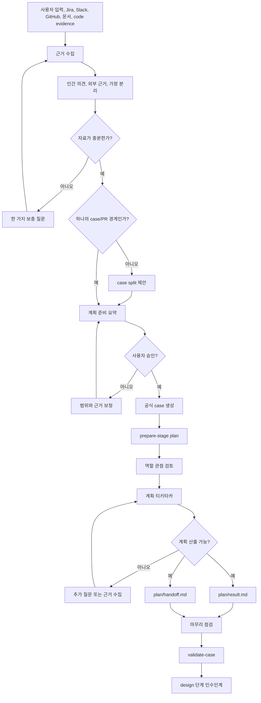

# Workflow

`sdlc-plan` helps humans turn incomplete ideas into evidence-backed planning decisions before
design and implementation.

## Pipeline Diagram



## Planning Intake

처음 요청을 받으면 바로 공식 case를 만들지 않는다. 먼저 자료가 충분한지 확인하고,
부족하면 한 가지 질문으로 보충한다.

입력 자료가 충분하면 사용자에게 `계획 준비 요약`을 보여준다. 이 요약은 case 생성을
승인받기 전의 확인 화면이다.

`계획 준비 요약`에는 다음 항목을 넣는다.

- case 후보: `yyyy-mm-dd-name`
- case/PR 경계: 하나의 trunk-based PR로 review 가능한지에 대한 판단
- 확인한 입력: 사용자가 준 내용, Jira, Slack, GitHub, 문서, code evidence
- 부족한 자료: 진행 판단 전에 더 필요한 정보, 없으면 `없음`
- 기본 검토 관점: 제품, 기술, QA, 위험, 배포 중 필요한 관점
- 검토 방식: 기본 검토와 별도 역할 Agent 검토 중 선택지
- 공식 case 생성: 아직 하지 않음
- 승인 요청: 이 구성으로 계획을 진행하고 case를 만들지 확인

사용자가 별도 역할 Agent 검토를 승인하면 native worker agent를 시도한다. 승인하지
않거나 runtime이 지원하지 않으면 기본 검토로 진행한다.

기본 검토는 같은 세션에서 역할별 관점을 나누어 수행하는 방식이다. 별도 역할 Agent를
쓰지 않았다는 사실은 runtime 기록에 남기되, 사용자-facing 결과의 중심 내용으로 만들지
않는다.

사용자가 case 생성을 승인하기 전에는 `.sdlc/cases/<case-id>/`를 만들지 않는다.
단, 자료 수집을 위한 임시 파일은 `.agents/runs/sdlc-plan/<run-id>/`에 둘 수 있다.

## Brainstorming Loop

1. Identify the starting context.
2. Find obvious Jira issues, Slack threads, GitHub issues, specs, docs, code, and previous cases.
3. Separate human opinion, external source content, and assumptions.
4. If 자료가 부족하면 한 가지 질문으로 보충한다.
5. Present the `계획 준비 요약` when the input is enough to continue.
6. Ask whether to use 별도 역할 Agent 검토 as part of the preparation summary.
7. Create approved case files only after user approval.
8. Try native worker agents after approval, or run same-session role review if unavailable.
9. Summarize current state and evidence gaps for the user.
10. Ask one focused question at a time.
11. Collect more evidence when the conversation exposes a gap.
12. Estimate scope and schedule considerations without making design or implementation decisions.
13. Check whether the case can be reviewed and merged as one trunk-based PR.
14. Explain expected impact.
15. Recommend `proceed`, `defer`, `split`, or `research-more`.
16. Create a case split proposal when the idea is too large or needs several PRs.
17. Write planning output and next-stage handoff after human approval.

Repository evidence is allowed in plan, but it is used to identify affected areas, feasibility
signals, risks, and design questions. Do not turn code findings into final technical choices.

역할 Agent 의견은 계획의 근거를 보강하기 위한 자료다. 사용자 승인이 없거나 runtime이
native agent를 지원하지 않으면, 동일 세션에서 역할별 검토를 수행하고 그 방식을 기록한다.

## Official State

Use approved case files for durable state:

```text
.sdlc/cases/<yyyy-mm-dd-name>/
  README.md
  metadata.yaml
  evidence.md

  plan/result.md
  plan/handoff.md
  design/result.md
  design/handoff.md
  build/tasks.md
  build/result.md
  build/handoff.md
  test/result.md
  test/handoff.md
  review/result.md
  review/handoff.md
  documentation/result.md
  documentation/handoff.md
  release/result.md
  release/handoff.md
```

Temporary run files can be verbose and exploratory. Approved case files must be concise and
decision-ready. Conversation history is helpful context, but it is not official state.

## Stage Recovery

Every SDLC stage starts by running:

```bash
.agents/sdlc/core/scripts/prepare-stage.sh <case-id> <stage>
```

The script prints the documents to read and write, then saves a stage context under
`.agents/runs/sdlc-stage/<case-id>/`. This protects the workflow when sessions compact or restart.

Important decisions must be checkpointed into files during the stage. Before finishing, run:

```bash
.agents/sdlc/core/scripts/validate-case.sh <case-id> <stage>
```

Plan and design use the same directional unit. Build breaks work into smaller implementation tasks.
