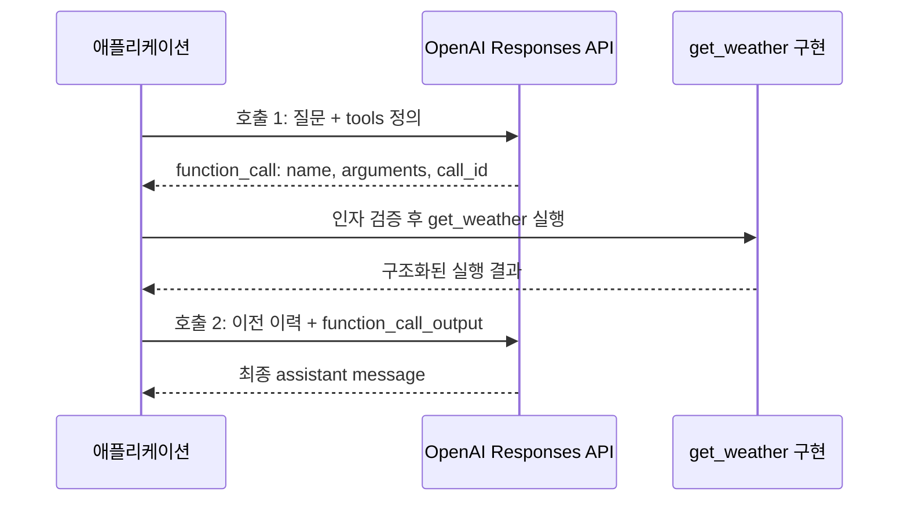

# OpenAI LLM API 예제 3: Tool call을 포함하는 응답

이 문서는 사용자 질문에 답하기 위해 외부 함수를 호출하는 API call과 payload를 설명한다.
공식 문서 확인 기준일은 2026-10-01이다.
사용자 질문은 `서울의 현재 기온을 확인해서 알려줘.`이다.
모델이 `get_weather` 호출을 요청하면 애플리케이션이 실행하고, 그 결과를 모델에 전달해 최종 답변을 얻는다.

## 전제와 호출 흐름

Responses API와 `gpt-5.6-terra`를 사용한다.
예제는 `store: false`로 실행하며 첫 요청과 모델의 output을 다음 요청에 직접 포함한다.
응답 JSON과 날씨 결과는 설명용 가상 데이터이며 실제 API 실행 결과나 현재 기온이 아니다.
Response의 일부 선택 필드는 생략했다.
이 사례에는 OpenAI API 호출이 두 번 있고, 그 사이에 애플리케이션 함수 실행이 한 번 있다.



Custom function의 실행 책임은 애플리케이션에 있다.
OpenAI는 모델이 선택한 함수 이름과 인자를 반환한다.
`web_search`, `file_search` 등 OpenAI가 제공하는 내장 도구는 별도의 서버 실행 방식이므로 이 예제의 custom function과 구분한다.

## 호출 1: 질문과 함수 정의 전달

### 호출 1의 API Call

다음 요청 JSON을 `tool-request-01.json`으로 저장한다.
유효한 서버 환경변수 `OPENAI_API_KEY`를 설정한 환경에서 호출한다.

```bash
curl --fail-with-body --silent --show-error \
  https://api.openai.com/v1/responses \
  -H "Authorization: Bearer $OPENAI_API_KEY" \
  -H "Content-Type: application/json" \
  --data-binary @tool-request-01.json
```

### 호출 1의 요청 Payload

```json
{
  "model": "gpt-5.6-terra",
  "instructions": "현재 기온은 get_weather 결과를 사용하고, 한국어로 간단히 답하세요.",
  "reasoning": { "effort": "none" },
  "max_output_tokens": 256,
  "store": false,
  "stream": false,
  "parallel_tool_calls": false,
  "tool_choice": { "type": "function", "name": "get_weather" },
  "tools": [
    {
      "type": "function",
      "name": "get_weather",
      "description": "지정한 도시의 현재 기온을 조회합니다.",
      "strict": true,
      "parameters": {
        "type": "object",
        "properties": {
          "location": { "type": "string", "description": "영문 도시 이름, 예: Seoul" },
          "unit": { "type": "string", "enum": ["celsius"] }
        },
        "required": ["location", "unit"],
        "additionalProperties": false
      }
    }
  ],
  "input": [
    { "role": "user", "content": "서울의 현재 기온을 확인해서 알려줘." }
  ]
}
```

| 필드 | 의미 |
| --- | --- |
| `tools[].type` | JSON Schema 인자를 사용하는 function tool |
| `tools[].name` | 애플리케이션의 함수 dispatch 이름 |
| `tools[].description` | 함수가 제공하는 정보와 용도 |
| `tools[].parameters` | 모델이 생성해야 하는 인자의 JSON Schema |
| `tools[].strict` | 지원되는 schema에 대한 엄격한 인자 구조 준수 |
| `tool_choice` | 이 예제에서 `get_weather` 호출을 지정 |
| `parallel_tool_calls` | 한 번에 여러 함수를 호출하지 않도록 false 지정 |

Responses의 함수 정의는 `name`, `parameters`, `strict`를 function tool 객체에 직접 둔다.
Chat Completions의 `tools[].function` 중첩 구조와 다르다.
Strict schema에서는 모든 properties를 required로 지정하고 각 object에 `additionalProperties: false`를 둔다.
Nullable 선택 필드가 필요하면 지원되는 schema에서 `null` 타입을 포함하는 방식으로 표현한다.

### 모델의 응답 Payload

모델은 첫 호출에서 최종 날씨 설명 대신 실행할 함수 정보를 반환한다.

```json
{
  "id": "resp_tool_01",
  "object": "response",
  "created_at": 1790812800,
  "status": "completed",
  "model": "gpt-5.6-terra",
  "error": null,
  "incomplete_details": null,
  "output": [
    {
      "id": "fc_weather_01",
      "type": "function_call",
      "status": "completed",
      "call_id": "call_weather_01",
      "name": "get_weather",
      "arguments": "{\"location\":\"Seoul\",\"unit\":\"celsius\"}"
    }
  ],
  "usage": {
    "input_tokens": 154,
    "input_tokens_details": { "cached_tokens": 0, "cache_write_tokens": 0 },
    "output_tokens": 22,
    "output_tokens_details": { "reasoning_tokens": 0 },
    "total_tokens": 176
  }
}
```

| 필드 | 해석 |
| --- | --- |
| `resp_tool_01` | 첫 모델 호출의 Response ID |
| `fc_weather_01` | 이 function_call item의 ID |
| `call_weather_01` | 함수 실행 결과와 연결할 호출 ID |
| `name` | 애플리케이션이 실행할 함수 |
| `arguments` | JSON으로 인코딩된 문자열 |

`arguments`는 JSON object가 아니라 JSON 문자열이다.
바깥 HTTP JSON을 파싱한 뒤 `arguments` 문자열을 한 번 더 JSON으로 파싱한다.
이때 얻는 인자는 다음 object이다.

```json
{
  "location": "Seoul",
  "unit": "celsius"
}
```

`status: "completed"`는 첫 모델 생성의 완료 상태이다.
이 상태만으로 사용자의 날씨 질문까지 모두 처리되었다고 판단하지 않는다.
`output`의 `function_call`을 처리해야 다음 단계가 진행된다.

## 애플리케이션에서 함수 실행

애플리케이션은 등록된 `get_weather` 구현에 파싱·검증한 인자를 전달한다.
외부 날씨 서비스 연결은 애플리케이션의 구현 사항이며, 함수 정의에 URL을 넣는 것만으로 자동 실행되지 않는다.
이 문서의 실행 결과는 다음 가상 object이다.

```json
{
  "location": "Seoul",
  "temperature": 22,
  "unit": "celsius",
  "observed_at": "2026-10-01T00:00:00Z"
}
```

이 object를 JSON 문자열로 직렬화해서 다음 요청의 `output` 값에 넣는다.
함수 이름은 등록된 함수 목록으로 dispatch하고, 인자 구조와 실행 결과를 애플리케이션에서 확인한다.
여러 호출이 있으면 각각의 `call_id`에 대응하는 결과를 만든다.

## 호출 2: 함수 실행 결과 전달

### 호출 2의 API Call

다음 요청 JSON을 `tool-request-02.json`으로 저장한다.

```bash
curl --fail-with-body --silent --show-error \
  https://api.openai.com/v1/responses \
  -H "Authorization: Bearer $OPENAI_API_KEY" \
  -H "Content-Type: application/json" \
  --data-binary @tool-request-02.json
```

### 호출 2의 요청 Payload

첫 질문, 첫 응답의 function_call, 함수 실행 결과를 순서대로 전송한다.
`store: false`이므로 이전 Response ID에 의존하지 않는다.

```json
{
  "model": "gpt-5.6-terra",
  "instructions": "현재 기온은 get_weather 결과를 사용하고, 한국어로 간단히 답하세요.",
  "reasoning": { "effort": "none" },
  "max_output_tokens": 256,
  "store": false,
  "stream": false,
  "parallel_tool_calls": false,
  "tool_choice": "none",
  "tools": [
    {
      "type": "function",
      "name": "get_weather",
      "description": "지정한 도시의 현재 기온을 조회합니다.",
      "strict": true,
      "parameters": {
        "type": "object",
        "properties": {
          "location": { "type": "string", "description": "영문 도시 이름, 예: Seoul" },
          "unit": { "type": "string", "enum": ["celsius"] }
        },
        "required": ["location", "unit"],
        "additionalProperties": false
      }
    }
  ],
  "input": [
    { "role": "user", "content": "서울의 현재 기온을 확인해서 알려줘." },
    {
      "id": "fc_weather_01",
      "type": "function_call",
      "status": "completed",
      "call_id": "call_weather_01",
      "name": "get_weather",
      "arguments": "{\"location\":\"Seoul\",\"unit\":\"celsius\"}"
    },
    {
      "type": "function_call_output",
      "call_id": "call_weather_01",
      "output": "{\"location\":\"Seoul\",\"temperature\":22,\"unit\":\"celsius\",\"observed_at\":\"2026-10-01T00:00:00Z\"}"
    }
  ]
}
```

`function_call_output.call_id`는 첫 응답의 `function_call.call_id`와 정확히 같아야 한다.
`fc_weather_01`이나 `resp_tool_01`을 이 필드에 넣지 않는다.
`output`은 함수 결과의 문자열이며 JSON 문자열 대신 일반 텍스트 결과도 보낼 수 있다.
지원되는 Responses 함수 결과는 이미지·파일 등을 포함하는 content 배열도 받을 수 있지만 이 예제에서는 문자열을 사용한다.

`tools` 정의는 앞선 요청과 동일하게 유지한다.
이번 요청의 추가 도구 호출은 `tool_choice: "none"`으로 제한하고 함수 결과로 최종 답변을 생성한다.
도구 목록을 유지하면 캐시의 공통 prefix를 보존하는 데도 도움이 된다.

### 최종 응답 Payload

```json
{
  "id": "resp_tool_02",
  "object": "response",
  "created_at": 1790812805,
  "status": "completed",
  "model": "gpt-5.6-terra",
  "error": null,
  "incomplete_details": null,
  "output": [
    {
      "id": "msg_weather_02",
      "type": "message",
      "status": "completed",
      "role": "assistant",
      "content": [
        {
          "type": "output_text",
          "text": "조회된 서울의 기온은 섭씨 22도입니다.",
          "annotations": [],
          "logprobs": []
        }
      ]
    }
  ],
  "usage": {
    "input_tokens": 211,
    "input_tokens_details": { "cached_tokens": 0, "cache_write_tokens": 0 },
    "output_tokens": 18,
    "output_tokens_details": { "reasoning_tokens": 0 },
    "total_tokens": 229
  }
}
```

애플리케이션이 사용자에게 보여줄 문자열은 message item의 output_text에 있다.
대화를 이어가려면 함수 호출과 결과를 포함한 이력에 최종 output도 추가한다.

## 호출 제어와 반복 처리

| 설정 또는 상태 | 처리 규칙 |
| --- | --- |
| `tool_choice: "auto"` | 모델이 텍스트 또는 도구 호출을 선택하며 호출은 0개·1개·여러 개일 수 있음 |
| `tool_choice: "required"` | 하나 이상의 도구 호출 요구 |
| 특정 함수 지정 | 이 예제의 첫 요청처럼 함수 name을 지정 |
| `tool_choice: "none"` | 이번 요청의 추가 도구 호출 제한 |
| 여러 `function_call` item | 각 호출을 식별하고 각각 결과 전달 |
| 함수 실행 실패 | 해당 call_id에 실패를 나타내는 결과를 전달하거나 애플리케이션에서 오류 처리 |
| 스트리밍 arguments | 호출별 delta를 모으고 완료 후 JSON 파싱 |

일반적인 tool loop는 두 번보다 더 많은 모델 호출이 필요할 수 있다.
다음 모델 응답도 도구 호출이면 실행·결과 전달 단계를 반복한다.
Reasoning 모델을 사용할 때 반환된 reasoning item도 다음 context에 보존한다.
최대 loop 횟수와 실행 timeout은 애플리케이션이 관리한다.
부수 효과가 있는 함수는 동일 작업을 중복 실행하지 않도록 애플리케이션에서 별도로 처리한다.

## Chat Completions의 대응 구조

| 단계 | Responses | Chat Completions |
| --- | --- | --- |
| 함수 정의 | `tools[].name` | `tools[].function.name` |
| 모델의 호출 요청 | `output[]`의 `function_call` | `choices[].message.tool_calls[]` |
| 호출 식별자 | `call_id` | `tool_calls[].id` |
| 실행 결과 전송 | `type: "function_call_output"` | `role: "tool"` message |
| 결과 연결 필드 | `call_id` | `tool_call_id` |
| 후속 이력 | user, function_call, function_call_output item | user, tool_calls가 있는 assistant, tool message |

Chat Completions에서는 tool 결과만 보내지 않고 해당 tool_calls를 포함하는 assistant message도 이력에 보존한다.
모델별로 Chat Completions의 reasoning과 tool calling 조합이 제한될 수 있다.
이 문서의 payload를 Chat Completions endpoint에 그대로 보내지 않는다.

## 공식 참고 문서

- [Function calling: 요청·실행·결과 전달](https://developers.openai.com/api/docs/guides/function-calling)
- [Function calling strict mode](https://developers.openai.com/api/docs/guides/function-calling#strict-mode)
- [Responses API create](https://developers.openai.com/api/reference/resources/responses/methods/create)
- [Prompt caching: tool 정의 유지](https://developers.openai.com/api/docs/guides/prompt-caching#manage-tools-with-append-only-updates)
- [공통 프로토콜 문서](openai-llm-api-protocol.md)
