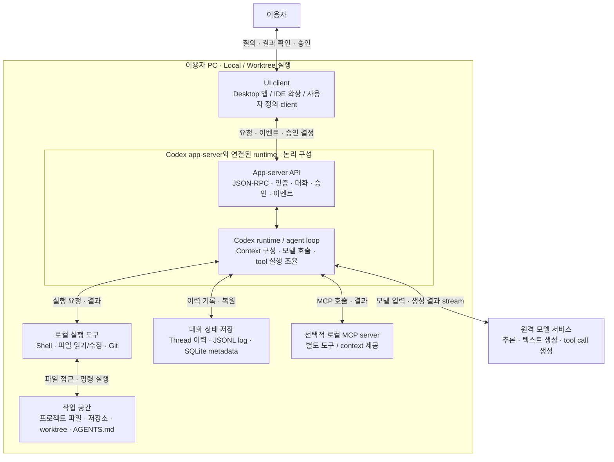
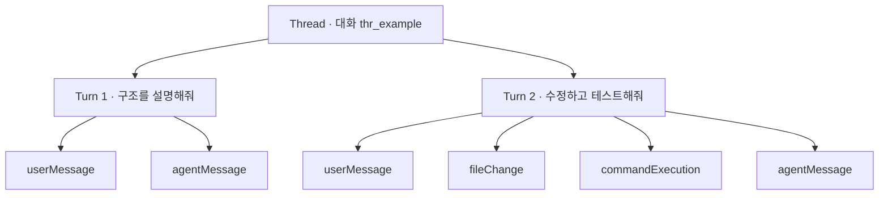
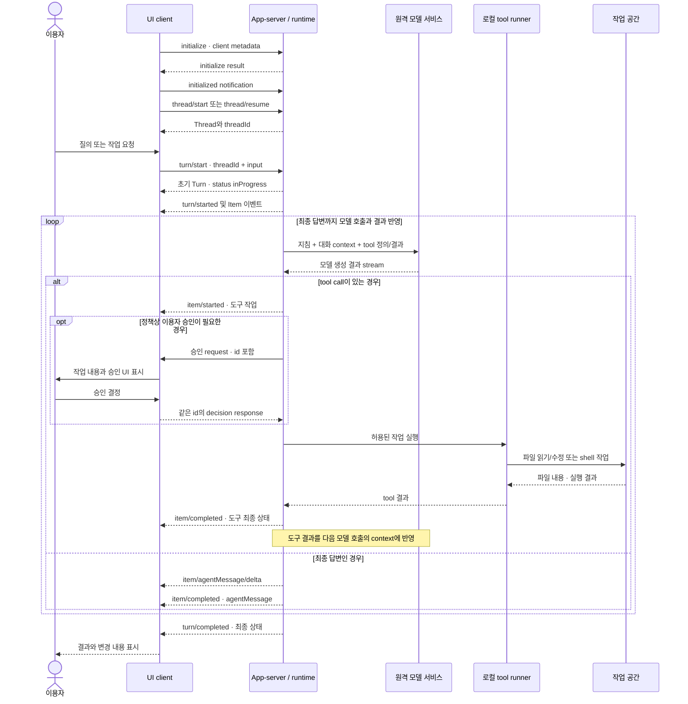
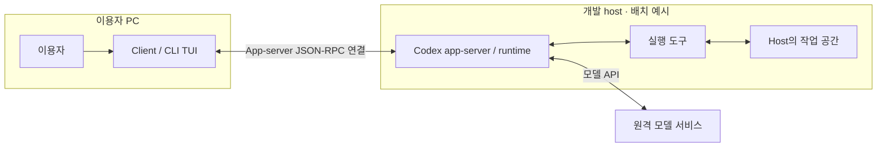

# Codex 아키텍처: 이용자·UI·app-server·작업 공간·원격 모델의 관계

Codex의 로컬 작업은 이용자 PC의 UI client와 Codex app-server/runtime이 협력하고, 원격 모델 서비스가 추론을 제공하는 구조로 이해할 수 있다.
UI는 입력과 진행 상황을 보여 주고, app-server는 대화·작업 실행을 제어하는 API를 제공하며, runtime은 모델 호출과 tool 실행을 이어 간다.
파일 읽기·수정과 shell 명령은 선택한 실행 환경에서 수행한다.

따라서 **이용자 PC 안에 client와 server 역할이 구분되어 있고, 별도 프로세스로 실행할 수 있다**는 설명은 맞다.
다만 앱 전체가 항상 정확히 두 개의 OS 프로세스로 구성된다는 뜻은 아니다.
여기서 로컬 server는 모델을 호스팅하는 원격 추론 server와 다른 구성 요소이다.

공식 문서 확인 기준일은 **2026-10-02**이다.
이 문서는 [Codex app-server](https://developers.openai.com/codex/app-server)와 [공식 용어집](https://developers.openai.com/codex/glossary)을 바탕으로 구성 요소와 통신 경계를 설명한다.
특정 desktop 앱 버전의 프로세스 목록이나 네트워크 트래픽을 직접 측정한 결과는 아니다.
첫 도식은 로컬 작업에서 원격 OpenAI 모델을 사용하는 경우이며, 다른 provider나 로컬 모델을 설정하면 추론 위치가 달라질 수 있다.

## 1. 로컬 작업의 전체 구조



도식의 상자는 역할을 나타내며, 상자마다 별도 프로세스가 있다는 뜻은 아니다.
App-server API와 runtime을 구분한 것은 client 통신 처리와 agent 작업 수행의 책임을 설명하기 위해서이다.
Runtime이 모델에 보낼 context를 구성하고, 모델이 반환한 tool call을 실제 실행 환경의 도구에 연결한다.
모델은 도구 사용을 요청하는 출력을 만들며, 로컬 파일에 직접 접근하는 주체는 실행 환경의 도구이다.

UI는 `turn/start` 같은 요청을 보내고, `item/*`와 `turn/*` 이벤트를 받아 화면을 갱신한다.
승인이 필요한 경우에는 app-server가 UI에 요청을 보내고, UI가 이용자의 결정을 반환한다.
이 때문에 UI와 app-server의 관계는 한 방향의 질문·답변 전송보다 넓다.

MCP server는 app-server에 연결되는 별도의 도구·자료 제공자이다.
도식에는 로컬 MCP server를 그렸지만, Streamable HTTP MCP server는 다른 host에서 동작할 수 있다.
Client가 제공하는 dynamic tool은 client에서 실행될 수도 있으므로 모든 tool이 app-server 프로세스 안에서 실행된다고 일반화하지 않는다.
이 dynamic tool API는 공식 문서상 experimental이다.

근거: [App-server의 역할·이벤트·dynamic tools](https://developers.openai.com/codex/app-server), [MCP 연결](https://developers.openai.com/codex/extend/mcp), [실행 환경](https://developers.openai.com/codex/environments/modes).

## 2. 용어와 각 구성 요소의 책임

| 용어 | 의미와 책임 | 다른 개념과의 관계 |
| --- | --- | --- |
| Codex | 소프트웨어 개발 작업을 수행하는 OpenAI의 coding agent | 하나의 모델 이름이나 UI 이름만을 뜻하지 않음 |
| Codex를 사용하는 desktop 앱 | 이용자가 대화, 프로젝트, 변경 내용과 진행 상황을 보는 앱 | UI와 로컬 실행 구성 요소를 함께 제공하는 제품 surface |
| UI client | 이용자 입력 수집, 이벤트 표시, 승인·추가 입력 처리 | App-server API를 호출하는 client 역할 |
| Codex app-server | Codex를 client에 통합하기 위한 JSON-RPC server | Thread·Turn·이력·인증·승인·streamed event API 제공 |
| Runtime / agent loop | Context를 구성하고 모델 호출·tool 실행·결과 반영을 이어 가는 실행 로직 | 이 문서에서 책임을 설명하는 명칭이며 별도 daemon을 뜻하지 않음 |
| Model | Context를 받아 추론하고 텍스트나 tool call을 생성하는 AI 모델 | Runtime이 이용하는 추론 구성 요소 |
| Tool | 파일 접근, shell 실행, MCP 호출 등 실제 작업을 수행하는 기능 | 모델의 tool call을 runtime과 실행 계층이 처리 |
| Workspace / 작업 공간 | 작업 대상 파일, 저장소와 실행 환경 | 모델 context와 구분되는 실제 파일·프로세스 환경 |
| `cwd` | Thread나 Turn의 작업 기준 디렉토리 | 경로 해석·도구 실행의 기준이며 권한 범위 전체와 같지 않음 |
| Git worktree | 같은 저장소의 별도 checkout | 작업 공간을 분리하지만 모델을 복제하거나 로컬 추론으로 바꾸지는 않음 |
| Context | 모델이 현재 작업에 사용할 메시지, 지침, 파일 내용과 tool 결과 | 작업 공간에서 읽은 정보와 이력으로 구성 |
| Context window | 모델이 한 번에 고려할 수 있는 정보량의 상한 | 저장된 전체 Thread 이력의 크기와 같지 않음 |
| `AGENTS.md` | 저장소나 이용자 범위의 지속적인 작업 지침 | 파일에서 읽혀 context 구성에 반영되는 guidance |
| Sandbox | 명령의 파일·네트워크 접근을 기술적으로 제한하는 실행 경계 | Approval policy와 별도의 계층 |
| Approval policy | 작업 전에 승인을 요청해야 하는 조건 | UI 승인 흐름과 실행 계층의 결정을 연결 |
| MCP server | MCP로 도구와 context를 제공하는 외부 구성 요소 | Codex app-server나 원격 모델 서비스와 다른 server |
| Codex CLI | 터미널에서 Codex를 사용하는 client와 실행 명령 | Remote TUI 모드에서는 별도 app-server에 연결 가능 |
| Codex SDK | 프로그램에서 Codex 작업을 제어하는 interface | 현재 Python SDK는 로컬 app-server를 JSON-RPC로 제어 |

Codex SDK와 app-server는 선택 목적도 다르다.
공식 문서는 CI·자동화에는 SDK를, 인증·대화 이력·승인·이벤트를 다루는 풍부한 client 통합에는 app-server를 안내한다.
SDK의 내부 실행 방식은 언어와 버전별로 확인해야 한다.
모든 SDK가 app-server를 우회하거나, 모든 CLI 실행이 별도 app-server를 띄운다고 가정하지 않는다.

근거: [공식 용어집](https://developers.openai.com/codex/glossary), [Codex SDK](https://developers.openai.com/codex/codex-sdk), [App-server](https://developers.openai.com/codex/app-server).

## 3. Thread → Turn → Item의 관계

Thread는 대화와 저장된 작업 이력을 담는 객체이다.
Turn은 보통 이용자 요청 한 번과 그 뒤에 이어지는 agent의 응답·작업을 묶는다.
Item은 Turn 안에 나타나는 입력·출력·작업의 단위이다.



위 도식은 포함 관계를 보여 주는 예시이며 모든 Item 타입이나 발생 순서를 나타내지는 않는다.
하나의 Turn에서 모델 호출과 tool 실행이 여러 번 반복될 수 있다.
따라서 **Turn 한 번 = 모델 API 호출 한 번**이라고 해석하면 안 된다.
작업 중 추가 입력을 보내는 `turn/steer`는 진행 중인 Turn을 조정하며 새 Turn을 만들지 않는다.

| 객체·이벤트 | 용도 | 완료 판단 |
| --- | --- | --- |
| `thread/start` | 새 대화 생성 | Thread 객체와 ID를 받음 |
| `thread/resume` | 저장된 대화 이어가기 | 기존 Thread를 다시 작업에 사용 |
| `thread/fork` | 기존 이력에서 새 대화 분기 | 새로운 Thread ID를 받음 |
| `turn/start` | 해당 Thread에 입력을 추가하고 작업 시작 | 초기 `inProgress` Turn을 받는 단계 |
| `item/started` | 메시지나 도구 작업 등 Item 시작 | 아직 최종 결과가 아님 |
| `item/agentMessage/delta` | Agent 메시지의 텍스트 조각 전달 | 텍스트를 누적하여 표시 |
| `item/completed` | 해당 Item의 최종 상태 전달 | Item 단위의 완료·실패 상태 확인 |
| `turn/completed` | Turn 종료와 최종 상태 전달 | `completed`, `interrupted`, `failed`를 구분 |

App-server의 `ThreadItem`과 Responses API의 `input[]`·`output[]` item은 서로 다른 interface의 타입이다.
예를 들어 UI가 받는 `commandExecution` Item과 모델이 생성하는 function call은 작업 흐름에서 연결될 수 있지만 동일한 JSON 객체는 아니다.
Thread ID, Turn ID, Item ID와 모델 API의 Response ID도 서로 바꿔 사용할 수 없다.

근거: [Core primitives·lifecycle·item types](https://developers.openai.com/codex/app-server).

## 4. 질의에서 파일 작업과 응답까지의 순서

다음 도식은 이용자 승인이 필요할 수 있는 로컬 도구 작업을 포함한 흐름이다.
실제 알림 수와 순서는 작업·도구·버전에 따라 달라지므로 핵심 경계만 표시했다.



승인이 거절되거나 취소되면 요청한 작업을 그대로 실행하는 흐름으로 진행하지 않는다.
Runtime은 해당 결정을 반영하고 Item·Turn의 상태를 client에 전달한다.
승인 없이 허용되는 작업은 도식의 승인 단계를 거치지 않을 수 있다.

이 흐름에서 server가 client에 보내는 승인 요청도 JSON-RPC request이다.
예를 들어 `item/commandExecution/requestApproval`과 `item/fileChange/requestApproval`을 UI가 받아 처리한다.
Request에는 `id`가 있고, client는 같은 `id`의 response로 결정을 반환한다.
진행 상황 알림인 notification에는 `id`가 없다.

Sandbox는 명령 실행의 기술적 경계이고, approval policy는 승인을 요청할 조건이다.
모델이 생성한 텍스트에 “허용한다”는 문장이 있다고 실행 권한이 자동으로 생기는 구조는 아니다.
또한 모든 app-server API가 같은 sandbox를 적용하는 것은 아니다.
`command/exec`는 server sandbox에서 실행하지만, 이용자가 직접 요청하는 `thread/shellCommand`와 experimental `process/spawn`은 공식 문서상 sandbox 밖에서 실행된다.

명령의 네트워크 제한과 모델·인증 통신도 구분한다.
Shell의 인터넷 접근이 제한되어 있어도 모델과 통신하는 연결까지 같은 정책으로 차단된다는 뜻은 아니다.

근거: [App-server의 approval·command API](https://developers.openai.com/codex/app-server), [Sandbox·승인·통신 경계](https://developers.openai.com/codex/agent-approvals-security).

## 5. 서로 다른 두 API 경계

| 구분 | UI client ↔ Codex app-server | Codex runtime ↔ 모델 서비스 |
| --- | --- | --- |
| 목적 | 대화·작업 제어, 승인, 이력, UI 이벤트 | 추론·텍스트·tool call 생성 |
| 입력 예 | `thread/start`, `turn/start` | 모델, 지침, 대화 context, tool 정의·결과 |
| 출력 예 | Thread·Turn·Item, delta, approval request | 모델의 생성 결과와 tool call |
| Protocol | 양방향 JSON-RPC 2.0 계열 메시지 | Provider와 인증 방식에 따른 모델 API |
| 전송 | 기본 stdio JSONL, 선택적 WebSocket·Unix socket | 모델 endpoint로 향하는 서비스 연결 |
| 상태 관리 | Thread 이력, 실행 상태, 작업 이벤트 | 요청에 전달된 context와 provider의 상태 기능 |

`turn/start`는 Codex 작업을 시작하는 명령이며 `POST /v1/responses`와 같은 모델 API 요청 본문이 아니다.
Runtime은 작업 진행에 따라 여러 모델 요청을 만들고 tool 결과를 다음 요청에 반영할 수 있다.
UI는 이 모델 요청을 직접 모두 구성하는 대신 app-server의 작업 interface를 사용할 수 있다.

OpenAI API key로 Responses API를 직접 사용하는 경우의 HTTP·Payload는 [API 개요](README.md)와 [Tool call 예제](tool-call.md)를 참고한다.
Codex의 모든 인증 방식과 provider가 항상 `https://api.openai.com/v1/responses`라는 주소를 사용한다고 단정하지 않는다.
공식 문서는 ChatGPT sign-in, API key와 custom model provider를 구분한다.

### 기본 stdio 연결과 프로세스 분리

공식 app-server client 예제는 다음과 같이 child process를 생성한다.
아래 JavaScript는 프로세스 시작 부분만 보여 주며, 초기화·이벤트 처리까지 갖춘 완전한 client는 아니다.

```javascript
import { spawn } from "node:child_process";

const proc = spawn("codex", ["app-server"], {
  stdio: ["pipe", "pipe", "inherit"],
});
```

이 구성에서 parent는 client이고 child는 `codex app-server`이다.
Client는 child의 stdin에 JSON 한 줄을 쓰고 stdout에서 JSON 한 줄씩 읽는다.
Stderr는 별도의 로그 경로이므로 protocol 메시지와 섞어 해석하지 않는다.
기본 stdio 연결은 TCP port나 HTTP listener가 필요하지 않다.

App-server는 JSON-RPC 2.0 방식의 메시지를 쓰지만 wire에서 `"jsonrpc":"2.0"` 필드는 생략한다.
연결마다 `initialize` request의 response를 받은 뒤 `initialized` notification을 보내고 다른 메서드를 호출한다.

### 메시지 예시

아래 ID와 경로는 예시이며, 응답은 설명에 필요한 필드만 남긴 축약형이다.
Stdio로 전송할 때에는 각 JSON 객체를 한 줄로 직렬화하고 줄바꿈을 붙인다.

Client → server 초기화 request:

```json
{
  "method": "initialize",
  "id": 0,
  "params": {
    "clientInfo": {
      "name": "architecture_example",
      "title": "Architecture Example",
      "version": "0.1.0"
    }
  }
}
```

초기화 response를 확인한 뒤 client → server notification:

```json
{ "method": "initialized", "params": {} }
```

새 Thread 생성 request:

```json
{
  "method": "thread/start",
  "id": 1,
  "params": { "cwd": "/Users/me/project" }
}
```

`thread/start` response의 `result.thread.id`를 읽고 다음 요청에 사용한다.
모델을 생략한 이 예시는 구성된 기본 모델을 사용하며, 특정 모델을 선택하려면 `model/list`에서 사용 가능한 값을 확인한다.

Turn 시작 request:

```json
{
  "method": "turn/start",
  "id": 2,
  "params": {
    "threadId": "thr_example",
    "input": [{ "type": "text", "text": "이 저장소 구조를 설명해줘." }]
  }
}
```

초기 Turn response:

```json
{
  "id": 2,
  "result": {
    "turn": {
      "id": "turn_example",
      "status": "inProgress",
      "items": [],
      "error": null
    }
  }
}
```

이 response는 작업이 시작되었다는 뜻이며 최종 답변이 아니다.
Client는 연결을 계속 읽고 Item 이벤트를 처리한 뒤 `turn/completed`의 최종 상태를 확인한다.
연결 종료나 중간 텍스트 수신만으로 성공을 판정하지 않는다.

근거: [Transport·message schema·initialization·turn lifecycle](https://developers.openai.com/codex/app-server), [인증과 provider](https://developers.openai.com/codex/auth).

## 6. 로컬·원격 host·Cloud는 무엇이 다른가

| 실행 형태 | 이용자 interface | 파일·shell 작업 위치 | 모델 추론 위치 |
| --- | --- | --- | --- |
| Local | 이용자 PC의 앱·IDE·터미널 | 이용자 PC의 현재 프로젝트 | 원격 OpenAI 모델 구성에서는 원격 서비스 |
| Worktree | 이용자 PC의 앱 | 같은 PC의 별도 Git checkout | Local과 동일한 모델 설정을 사용 가능 |
| Remote app-server 연결 | 이용자 PC의 client | 연결된 host의 실행 환경·작업 공간 | 해당 host가 사용하는 모델 서비스 |
| Codex Cloud | 앱·웹·IDE 등의 task interface | Cloud task의 작업 공간·저장소·도구 | Cloud가 사용하는 모델 서비스 |

**작업이 로컬에서 실행되는 것과 모델 추론이 로컬에서 수행되는 것은 다른 조건이다.**
로컬 shell·파일 도구를 사용하면서 모델은 원격 서비스를 이용할 수 있다.
반대로 원격 모델을 사용한다는 이유만으로 그 작업이 Codex Cloud task인 것은 아니다.

App-server의 Remote TUI 모드는 client와 app-server를 서로 다른 host에 둘 수 있다.
다음은 app-server와 작업 공간을 개발 host에 배치한 구성의 예시이다.
Cloud 제품의 내부 서비스·프로세스 구성을 나타내는 도식은 아니다.



같은 PC에서 두 터미널로 연결 구조를 확인하는 공식 예시는 다음과 같다.

```bash
# 터미널 A: app-server listener
codex app-server --listen ws://127.0.0.1:4500
```

```bash
# 터미널 B: 해당 app-server에 연결하는 CLI TUI
codex --remote ws://127.0.0.1:4500
```

이 loopback 예시는 같은 host에 연결하며, 다른 host로 배치하는 경우에는 연결 경로와 host 접근을 별도로 구성한다.
공식 문서상 WebSocket transport는 experimental이며 production workload용으로 지원되지 않는다.
비로컬 WebSocket 연결을 제공할 때에는 공식 문서가 요구하는 인증과 TLS를 구성한다.
Unix socket transport도 지원하며, HTTP Upgrade를 사용하는 WebSocket 연결이다.

Cloud task는 원격 environment에 준비된 저장소·파일·도구를 사용한다.
이용자 PC의 파일, 실행 중인 프로세스, 브라우저 로그인과 VPN 접근이 자동으로 Cloud에 전달되지는 않는다.
또한 이용자가 시작한 Remote app-server host와 OpenAI의 Codex Cloud environment는 서로 다른 배치 방식이다.

근거: [CLI remote 연결·transport](https://developers.openai.com/codex/app-server), [Local·Worktree·Cloud](https://developers.openai.com/codex/environments/modes).

## 7. 두 역할과 실제 프로세스 수를 구분해야 하는 이유

UI client와 app-server는 분리된 역할이며, stdio child process 예제에서는 실제 프로세스도 분리된다.
하지만 desktop UI의 helper, shell 명령, 실행 도구와 STDIO MCP server 등이 별도 프로세스로 추가될 수 있다.
공식 app-server 문서만으로 특정 desktop 배포판의 전체 PID 수와 부모·자식 관계를 확정할 수는 없다.

현재 공식 문서는 app-server가 기본적으로 로컬 **Code Mode host**를 시작한다고 설명한다.
`--code-mode-host wss://...`로 원격 host 연결을 선택할 수 있으며, 같은 app-server 프로세스의 모든 Thread가 선택한 연결을 공유한다.

| 설정 | 연결 방향 | 제어하는 경계 |
| --- | --- | --- |
| `--listen` | Client → app-server | Client가 app-server에 접속하는 inbound transport |
| `--code-mode-host` | App-server → Code Mode host | App-server가 선택한 host로 연결하는 outbound 경계 |

Code Mode host 연결을 바꾸는 것은 app-server listener를 바꾸는 설정이 아니다.
또한 Code Mode host를 원격 모델 추론 server나 프로젝트 디렉토리와 같은 개념으로 취급하지 않는다.
이 문서는 공개된 연결 계약까지만 설명하며, Code Mode host의 내부 프로세스 구성과 모든 작업의 실행 위치를 추정하지 않는다.

실제 앱의 배치를 조사할 때에는 앱·Codex 버전, 선택한 Local·Remote·Cloud 실행 형태, transport와 provider를 함께 기록해야 한다.
특정 버전에서 확인한 프로세스 구조를 모든 Codex surface에 동일하게 적용하지 않는다.

근거: [Code Mode host·client transport](https://developers.openai.com/codex/app-server), [MCP process 연결](https://developers.openai.com/codex/extend/mcp).

## 8. 작업 공간·이력·Context·Compaction·캐시의 관계

작업 공간은 파일과 프로세스가 존재하는 실제 환경이다.
저장된 Thread 이력은 이전 메시지와 작업 결과를 다시 읽거나 이어 가기 위한 기록이다.
현재 모델 context는 그 이력, 필요한 파일 내용, 지침과 tool 결과로 구성되는 모델 입력이다.
이 셋을 같은 저장소나 같은 데이터 객체로 이해하면 파일 접근 범위와 모델의 기억 범위를 혼동하기 쉽다.

예를 들어 tool이 파일을 읽으면 그 결과가 모델 context에 들어갈 수 있다.
Tool이 파일을 수정하면 작업 공간의 파일이 바뀌고, 결과·diff·메시지가 이력과 UI 이벤트에 반영된다.
모델 context에서 오래된 상세 내용이 줄어들어도 실제 파일의 현재 상태는 작업 공간에서 다시 확인할 수 있다.

| 기능 | 대상과 목적 | 구분해야 할 점 |
| --- | --- | --- |
| 이력 저장·resume | 대화와 작업 기록을 유지하고 이어가기 | 저장된 전체 이력이 매번 모델 입력에 그대로 들어간다는 보장은 없음 |
| Context compaction | 긴 대화를 계속할 수 있도록 오래된 context를 요약·축약 | 파일 checkout 변경이나 Git commit이 아님 |
| Prompt caching | 반복되는 모델 입력 prefix의 계산 재사용 | Thread 저장이나 context window 확대 기능이 아님 |

App-server의 `thread/compact/start`는 compaction을 시작하고 `{}`를 즉시 반환한다.
실제 진행·완료는 같은 Thread의 `turn/*`·`item/*` 이벤트와 `contextCompaction` Item의 lifecycle로 확인한다.
RPC response를 받았다는 이유만으로 compaction이 이미 끝났다고 표시하면 안 된다.
Compaction이 입력 prefix를 바꾸면 이후 캐시 재사용 범위도 달라질 수 있으므로 context 관리와 캐시 효과를 함께 평가한다.

프롬프트 캐시 규칙과 직접 API 예제는 [여러 차례 대화와 프롬프트 캐시](prompt-caching.md)를 참고한다.

근거: [Thread 저장·resume·compaction](https://developers.openai.com/codex/app-server), [Context·compaction 용어](https://developers.openai.com/codex/glossary), [Prompt caching](https://developers.openai.com/api/docs/guides/prompt-caching).

## 공식 참고 문서

- [Codex app-server: 역할, transport, schema, lifecycle, approval, remote와 Code Mode host](https://developers.openai.com/codex/app-server)
- [Codex glossary: Codex, model, thread, turn, context, sandbox 등의 정의](https://developers.openai.com/codex/glossary)
- [Codex environments: Local, Worktree, Cloud 실행 위치](https://developers.openai.com/codex/environments/modes)
- [Codex SDK: 자동화 interface와 Python app-server 연결](https://developers.openai.com/codex/codex-sdk)
- [MCP: 로컬 STDIO와 Streamable HTTP server](https://developers.openai.com/codex/extend/mcp)
- [Agent approvals & security: 실행 권한, 승인, 명령 네트워크와 모델 통신의 경계](https://developers.openai.com/codex/agent-approvals-security)
- [Authentication: ChatGPT sign-in, API key, custom model provider](https://developers.openai.com/codex/auth)
- [Prompt caching: 반복 입력의 캐시 재사용](https://developers.openai.com/api/docs/guides/prompt-caching)
