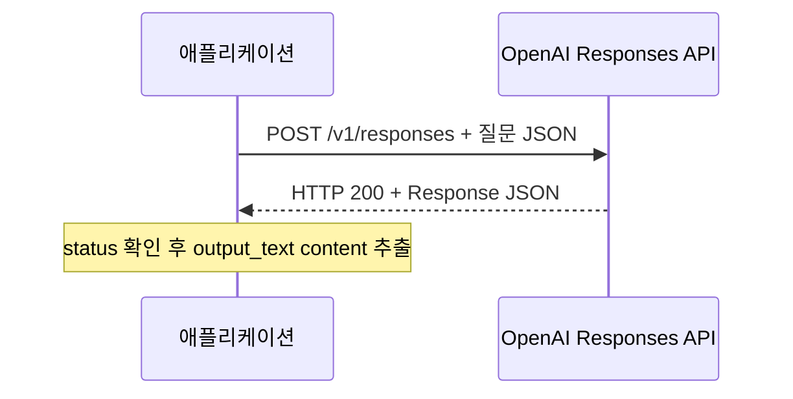

# OpenAI LLM API 예제 1: 간단한 질의와 응답

이 문서는 한 번의 질문과 답변에 필요한 API call과 payload를 설명한다.
공식 문서 확인 기준일은 2026-10-01이다.
사용자는 `대한민국의 수도는 어디야?`라고 질문하고 모델은 `대한민국의 수도는 서울입니다.`라고 답한다.

## 전제와 호출 흐름

주 예제는 Responses API와 `gpt-5.6-terra`를 사용한다.
`reasoning.effort: "none"`으로 지정해 이 예제에서 reasoning 없이 짧게 답하게 한다.
`store: false`와 `stream: false`를 명시한다.
응답 JSON은 주요 필드를 보여 주는 가상 데이터이며 실제 실행 결과가 아니다.
ID·토큰 수·시각·생성 문구는 예시 값이고 나머지 응답 필드는 생략했다.



## API Call

| 항목 | 값 |
| --- | --- |
| 메서드 | `POST` |
| URL | `https://api.openai.com/v1/responses` |
| 인증 | `Authorization: Bearer $OPENAI_API_KEY` |
| 요청 Content-Type | `application/json` |
| 응답 형식 | `application/json` |
| 필요한 API 호출 수 | 1회 |

다음 명령은 그대로 실행할 수 있는 요청 형태이다.
실행하려면 서버 환경에 유효한 `OPENAI_API_KEY`가 있어야 하며 실제 API 사용 요금이 발생한다.

```bash
curl --fail-with-body --silent --show-error \
  https://api.openai.com/v1/responses \
  -H "Authorization: Bearer $OPENAI_API_KEY" \
  -H "Content-Type: application/json" \
  -H "Accept: application/json" \
  --data-binary '{
    "model": "gpt-5.6-terra",
    "instructions": "한국어로 한 문장으로 답하세요.",
    "input": "대한민국의 수도는 어디야?",
    "reasoning": { "effort": "none" },
    "max_output_tokens": 128,
    "store": false,
    "stream": false
  }'
```

`--data-binary`를 지정했으므로 curl은 POST로 호출한다.
응답 헤더의 `x-request-id`까지 확인하려면 `--include` 옵션을 추가한다.

## 요청 Payload

curl이 보내는 JSON body는 다음과 같다.

```json
{
  "model": "gpt-5.6-terra",
  "instructions": "한국어로 한 문장으로 답하세요.",
  "input": "대한민국의 수도는 어디야?",
  "reasoning": { "effort": "none" },
  "max_output_tokens": 128,
  "store": false,
  "stream": false
}
```

| 필드 | 예제에서의 역할 |
| --- | --- |
| `model` | Responses를 지원하는 모델 지정 |
| `instructions` | 답변 언어와 길이를 정하는 developer 지침 |
| `input` | 사용자의 질문이며 이 경우 string shorthand 사용 |
| `reasoning.effort` | 이 모델에서 지원하는 `none` 지정 |
| `max_output_tokens` | 출력 토큰 상한 |
| `store` | Response 저장 여부 |
| `stream` | 전체 JSON을 한 번에 받을지 여부 |

String 형태의 `input`은 간단한 텍스트 질문에 편리하다.
메시지 role이나 여러 content part가 필요하면 `input`을 item 배열로 구성한다.

## 응답 Payload

정상 응답은 HTTP 200과 다음 구조의 JSON으로 전달된다.

```json
{
  "id": "resp_simple_01",
  "object": "response",
  "created_at": 1790812800,
  "status": "completed",
  "model": "gpt-5.6-terra",
  "error": null,
  "incomplete_details": null,
  "output": [
    {
      "id": "msg_simple_01",
      "type": "message",
      "status": "completed",
      "role": "assistant",
      "content": [
        {
          "type": "output_text",
          "text": "대한민국의 수도는 서울입니다.",
          "annotations": [],
          "logprobs": []
        }
      ]
    }
  ],
  "usage": {
    "input_tokens": 42,
    "input_tokens_details": { "cached_tokens": 0, "cache_write_tokens": 0 },
    "output_tokens": 12,
    "output_tokens_details": { "reasoning_tokens": 0 },
    "total_tokens": 54
  }
}
```

| 필드 또는 경로 | 해석 |
| --- | --- |
| `id` | 이번 Response의 ID이며 HTTP 요청 ID와 별개 |
| `object` | 객체 종류가 `response`임을 표시 |
| `created_at` | 초 단위 Unix timestamp |
| `status` | 이번 생성이 정상 완료되었는지 확인 |
| `output[0].type` | 이 예제에서는 텍스트를 포함하는 message |
| `output[0].content[0].type` | 사용자에게 표시할 텍스트 part |
| `output[0].content[0].text` | 최종 답변 문자열 |
| `usage` | 토큰 사용량이며 숫자는 설명용 |

이 예제에는 message 하나와 text part 하나만 있다.
실제 구현에서는 `output` 전체를 순회하고 `type`으로 구분한다.
`incomplete`·`failed` 또는 거절 응답이 있으면 정상 텍스트 답변과 구분한다.
이처럼 짧은 요청만으로 프롬프트 캐시 효과를 기대하지 않는다.

## 같은 질의를 Chat Completions로 호출하는 경우

Endpoint는 `https://api.openai.com/v1/chat/completions`이다.
위 curl의 URL과 JSON body를 다음 값으로 교체하면 된다.
Reasoning 설정은 `reasoning_effort`이고 출력 상한은 `max_completion_tokens`이다.

```json
{
  "model": "gpt-5.6-terra",
  "messages": [
    { "role": "developer", "content": "한국어로 한 문장으로 답하세요." },
    { "role": "user", "content": "대한민국의 수도는 어디야?" }
  ],
  "reasoning_effort": "none",
  "max_completion_tokens": 128,
  "store": false,
  "stream": false
}
```

주요 필드를 발췌한 가상 응답은 다음과 같다.

```json
{
  "id": "chatcmpl_simple_01",
  "object": "chat.completion",
  "created": 1790812800,
  "model": "gpt-5.6-terra",
  "choices": [
    {
      "index": 0,
      "message": {
        "role": "assistant",
        "content": "대한민국의 수도는 서울입니다.",
        "refusal": null
      },
      "finish_reason": "stop"
    }
  ],
  "usage": {
    "prompt_tokens": 42,
    "prompt_tokens_details": { "cached_tokens": 0, "cache_write_tokens": 0 },
    "completion_tokens": 12,
    "completion_tokens_details": { "reasoning_tokens": 0 },
    "total_tokens": 54
  }
}
```

Chat Completions는 `choices[].message.content`에서 답변을 읽는다.
`finish_reason: "stop"`은 정상 종료, `length`는 토큰 상한 도달, `tool_calls`는 도구 호출을 의미한다.
Responses의 `output` 배열과 Chat Completions의 `choices` 배열을 혼용하지 않는다.

## 공식 참고 문서

- [Responses API create](https://developers.openai.com/api/reference/resources/responses/methods/create)
- [Chat Completions API create](https://platform.openai.com/docs/api-reference/chat)
- [Responses와 Chat Completions 비교](https://developers.openai.com/api/docs/guides/migrate-to-responses)
- [GPT-5.6 Terra](https://developers.openai.com/api/docs/models/gpt-5.6-terra)
- [공통 프로토콜 문서](README.md)
