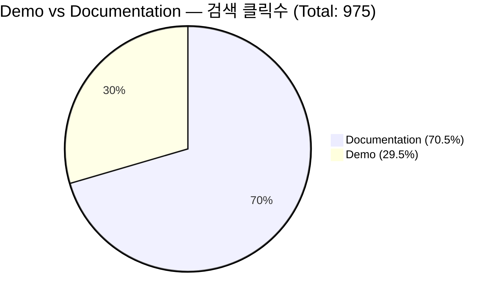
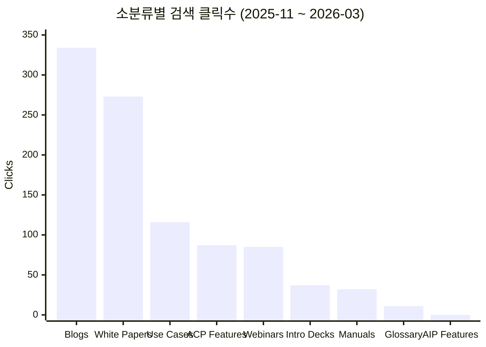

# QueryPie Homepage 컨텐츠 분류별 검색 유입 리포트

- **사이트:** https://www.querypie.com/
- **기간:** 2025-11-01 ~ 2026-03-28 (5개월)
- **생성일:** 2026-03-31
- **도구:** `bin/gsc-content-report`

## 컨텐츠 분류 기준

| 대분류 | 소분류 | URL 패턴 |
|--------|--------|----------|
| Demo | Use Cases | `/features/demo/use-cases/**` |
| Demo | AIP Features | `/features/demo/aip-features/**` |
| Demo | ACP Features | `/features/demo/acp-features/**` |
| Demo | Webinars | `/features/demo/webinars/**` |
| Documentation | Introduction Decks | `/features/documentation/*-introduction-download` |
| Documentation | Glossary | `/features/documentation/glossary-items` |
| Documentation | Manuals | `/features/documentation/querypie-install-guide` |
| Documentation | White Papers | `/features/documentation/white-paper/**` |
| Documentation | Blogs | `/features/documentation/blog/**` |

> locale prefix (`/ko`, `/ja`, `/en`)는 자동 제거 후 매칭

## 차트

### 대분류별 클릭수 비중

### 소분류별 클릭수 (전체)

### 월별 클릭수 추이

```mermaid
xychart-beta
    title "월별 검색 클릭수 추이"
    x-axis ["2025-11", "2025-12", "2026-01", "2026-02", "2026-03"]
    y-axis "Clicks" 0 --> 300
    bar [59, 78, 78, 38, 35]
    bar [218, 209, 152, 44, 64]
    line [277, 287, 230, 82, 99]
```

### 월별 노출수 추이

```mermaid
xychart-beta
    title "월별 검색 노출수 추이"
    x-axis ["2025-11", "2025-12", "2026-01", "2026-02", "2026-03"]
    y-axis "Impressions" 0 --> 80000
    bar [3804, 5479, 6394, 3093, 2690]
    bar [38969, 67862, 66365, 26532, 29081]
    line [42773, 73341, 72759, 29625, 31771]
```

## 전체 합산

| 대분류 | 소분류 | 클릭 | 노출 | CTR |
|--------|--------|-----:|-----:|----:|
| **Demo** | Use Cases | 116 | 11,160 | 1.0% |
| | AIP Features | 0 | 4 | 0.0% |
| | ACP Features | 87 | 7,245 | 1.2% |
| | Webinars | 85 | 3,051 | 2.8% |
| | **소계** | **288** | **21,460** | **1.3%** |
| **Documentation** | Introduction Decks | 37 | 2,096 | 1.8% |
| | Glossary | 11 | 235 | 4.7% |
| | Manuals | 32 | 1,451 | 2.2% |
| | White Papers | 273 | 83,913 | 0.3% |
| | Blogs | 334 | 141,114 | 0.2% |
| | **소계** | **687** | **228,809** | **0.3%** |
| | **합계** | **975** | **250,269** | **0.4%** |

## 월별 집계

### 2025-11 (컨텐츠 론칭 월)

| 대분류 | 소분류 | 클릭 | 노출 | CTR |
|--------|--------|-----:|-----:|----:|
| **Demo** | Use Cases | 26 | 2,254 | 1.2% |
| | AIP Features | 0 | 2 | 0.0% |
| | ACP Features | 24 | 1,026 | 2.3% |
| | Webinars | 9 | 522 | 1.7% |
| | **소계** | **59** | **3,804** | **1.6%** |
| **Documentation** | Introduction Decks | 19 | 341 | 5.6% |
| | Glossary | 0 | 77 | 0.0% |
| | Manuals | 22 | 194 | 11.3% |
| | White Papers | 83 | 16,728 | 0.5% |
| | Blogs | 94 | 21,629 | 0.4% |
| | **소계** | **218** | **38,969** | **0.6%** |
| | **합계** | **277** | **42,773** | **0.6%** |

### 2025-12

| 대분류 | 소분류 | 클릭 | 노출 | CTR |
|--------|--------|-----:|-----:|----:|
| **Demo** | Use Cases | 31 | 2,802 | 1.1% |
| | AIP Features | 0 | 1 | 0.0% |
| | ACP Features | 22 | 1,847 | 1.2% |
| | Webinars | 25 | 829 | 3.0% |
| | **소계** | **78** | **5,479** | **1.4%** |
| **Documentation** | Introduction Decks | 9 | 490 | 1.8% |
| | Glossary | 6 | 43 | 14.0% |
| | Manuals | 4 | 150 | 2.7% |
| | White Papers | 76 | 24,142 | 0.3% |
| | Blogs | 114 | 43,037 | 0.3% |
| | **소계** | **209** | **67,862** | **0.3%** |
| | **합계** | **287** | **73,341** | **0.4%** |

### 2026-01

| 대분류 | 소분류 | 클릭 | 노출 | CTR |
|--------|--------|-----:|-----:|----:|
| **Demo** | Use Cases | 31 | 3,300 | 0.9% |
| | AIP Features | 0 | 0 | - |
| | ACP Features | 18 | 2,040 | 0.9% |
| | Webinars | 29 | 1,054 | 2.8% |
| | **소계** | **78** | **6,394** | **1.2%** |
| **Documentation** | Introduction Decks | 6 | 488 | 1.2% |
| | Glossary | 3 | 36 | 8.3% |
| | Manuals | 5 | 540 | 0.9% |
| | White Papers | 64 | 21,937 | 0.3% |
| | Blogs | 74 | 43,364 | 0.2% |
| | **소계** | **152** | **66,365** | **0.2%** |
| | **합계** | **230** | **72,759** | **0.3%** |

### 2026-02

| 대분류 | 소분류 | 클릭 | 노출 | CTR |
|--------|--------|-----:|-----:|----:|
| **Demo** | Use Cases | 18 | 1,466 | 1.2% |
| | AIP Features | 0 | 1 | 0.0% |
| | ACP Features | 10 | 1,289 | 0.8% |
| | Webinars | 10 | 337 | 3.0% |
| | **소계** | **38** | **3,093** | **1.2%** |
| **Documentation** | Introduction Decks | 0 | 414 | 0.0% |
| | Glossary | 1 | 25 | 4.0% |
| | Manuals | 1 | 292 | 0.3% |
| | White Papers | 21 | 10,117 | 0.2% |
| | Blogs | 21 | 15,684 | 0.1% |
| | **소계** | **44** | **26,532** | **0.2%** |
| | **합계** | **82** | **29,625** | **0.3%** |

### 2026-03 (3/1 ~ 3/28)

| 대분류 | 소분류 | 클릭 | 노출 | CTR |
|--------|--------|-----:|-----:|----:|
| **Demo** | Use Cases | 10 | 1,338 | 0.7% |
| | AIP Features | 0 | 0 | - |
| | ACP Features | 13 | 1,043 | 1.2% |
| | Webinars | 12 | 309 | 3.9% |
| | **소계** | **35** | **2,690** | **1.3%** |
| **Documentation** | Introduction Decks | 3 | 363 | 0.8% |
| | Glossary | 1 | 54 | 1.9% |
| | Manuals | 0 | 275 | 0.0% |
| | White Papers | 29 | 10,989 | 0.3% |
| | Blogs | 31 | 17,400 | 0.2% |
| | **소계** | **64** | **29,081** | **0.2%** |
| | **합계** | **99** | **31,771** | **0.3%** |

## 월별 추이 요약

| 월 | Demo 클릭 | Doc 클릭 | 합계 클릭 | Demo 노출 | Doc 노출 | 합계 노출 |
|----|----------:|---------:|----------:|----------:|---------:|----------:|
| 2025-11 | 59 | 218 | 277 | 3,804 | 38,969 | 42,773 |
| 2025-12 | 78 | 209 | 287 | 5,479 | 67,862 | 73,341 |
| 2026-01 | 78 | 152 | 230 | 6,394 | 66,365 | 72,759 |
| 2026-02 | 38 | 44 | 82 | 3,093 | 26,532 | 29,625 |
| 2026-03 | 35 | 64 | 99 | 2,690 | 29,081 | 31,771 |

## GA PV 대비 비교

| 월 | GA PV | GSC 클릭 | 검색 유입 비율 |
|----|------:|---------:|---------------:|
| 2025-11 | 2,293 | 277 | 12.1% |
| 2025-12 | 1,767 | 287 | 16.2% |
| 2026-01 | 1,629 | 230 | 14.1% |
| 2026-02 | 1,164 | 82 | 7.0% |
| 2026-03 | 924 | 99 | 10.7% |
| **합계** | **7,777** | **975** | **12.5%** |

## 참고

- 2025-10은 컨텐츠 론칭 전이므로 제외
- 2026-03은 3/28까지 (GSC 데이터는 최근 3일 불완전)
- AIP Features는 전 기간 클릭 0, 노출 4로 검색 유입 없음
- Blogs는 노출 141,114로 압도적이나 CTR 0.2%로 매우 낮음 (순위 개선 여지)
- White Papers도 노출 83,913 대비 CTR 0.3%로 비슷한 패턴
- Demo 카테고리는 노출 대비 CTR이 상대적으로 높음 (1.3% vs 0.3%)
- 전체 검색 유입은 GA PV의 약 12.5%
