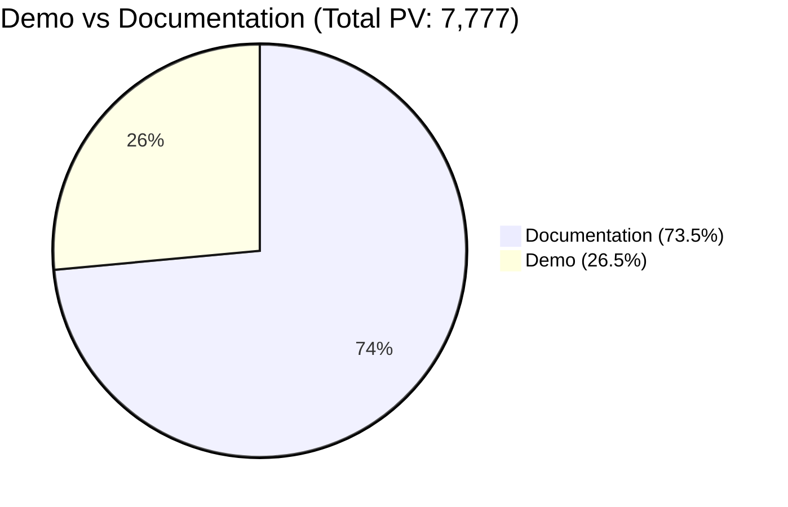
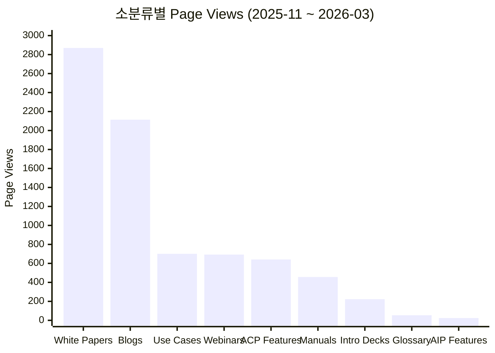

# QueryPie Homepage 컨텐츠 분류별 Page View 리포트

- **Property:** QueryPie Homepage (451239708)
- **기간:** 2025-11-01 ~ 2026-03-30 (5개월)
- **생성일:** 2026-03-31
- **도구:** `bin/ga-content-report`

## 컨텐츠 분류 기준

| 대분류 | 소분류 | URL 패턴 |
|--------|--------|----------|
| Demo | Use Cases | `/features/demo/use-cases/**` |
| Demo | AIP Features | `/features/demo/aip-features/**` |
| Demo | ACP Features | `/features/demo/acp-features/**` |
| Demo | Webinars | `/features/demo/webinars/**` |
| Documentation | Introduction Decks | `/features/documentation/*-introduction-download` |
| Documentation | Glossary | `/features/documentation/glossary-items` |
| Documentation | Manuals | `/features/documentation/querypie-install-guide` |
| Documentation | White Papers | `/features/documentation/white-paper/**` |
| Documentation | Blogs | `/features/documentation/blog/**` |

> locale prefix (`/ko`, `/ja`, `/en`)는 자동 제거 후 매칭

## 차트

### 대분류별 비중 (전체)

### 소분류별 PV (전체)

### 월별 추이

```mermaid
xychart-beta
    title "월별 Page Views 추이"
    x-axis ["2025-11", "2025-12", "2026-01", "2026-02", "2026-03"]
    y-axis "Page Views" 0 --> 2500
    bar [580, 475, 504, 266, 234]
    bar [1713, 1292, 1125, 898, 690]
    line [2293, 1767, 1629, 1164, 924]
```

## 전체 합산

| 대분류 | 소분류 | Page Views | 비중 |
|--------|--------|----------:|-----:|
| **Demo** | Use Cases | 701 | 9.0% |
| | AIP Features | 24 | 0.3% |
| | ACP Features | 641 | 8.2% |
| | Webinars | 693 | 8.9% |
| | **소계** | **2,059** | **26.5%** |
| **Documentation** | Introduction Decks | 223 | 2.9% |
| | Glossary | 54 | 0.7% |
| | Manuals | 457 | 5.9% |
| | White Papers | 2,870 | 36.9% |
| | Blogs | 2,114 | 27.2% |
| | **소계** | **5,718** | **73.5%** |
| | **합계** | **7,777** | |

## 월별 집계

### 2025-11 (컨텐츠 론칭 월)

| 대분류 | 소분류 | Page Views |
|--------|--------|----------:|
| **Demo** | Use Cases | 168 |
| | AIP Features | 6 |
| | ACP Features | 230 |
| | Webinars | 176 |
| | **소계** | **580** |
| **Documentation** | Introduction Decks | 61 |
| | Glossary | 9 |
| | Manuals | 152 |
| | White Papers | 876 |
| | Blogs | 615 |
| | **소계** | **1,713** |
| | **합계** | **2,293** |

### 2025-12

| 대분류 | 소분류 | Page Views |
|--------|--------|----------:|
| **Demo** | Use Cases | 164 |
| | AIP Features | 3 |
| | ACP Features | 138 |
| | Webinars | 170 |
| | **소계** | **475** |
| **Documentation** | Introduction Decks | 47 |
| | Glossary | 19 |
| | Manuals | 83 |
| | White Papers | 575 |
| | Blogs | 568 |
| | **소계** | **1,292** |
| | **합계** | **1,767** |

### 2026-01

| 대분류 | 소분류 | Page Views |
|--------|--------|----------:|
| **Demo** | Use Cases | 219 |
| | AIP Features | 7 |
| | ACP Features | 127 |
| | Webinars | 151 |
| | **소계** | **504** |
| **Documentation** | Introduction Decks | 41 |
| | Glossary | 15 |
| | Manuals | 111 |
| | White Papers | 545 |
| | Blogs | 413 |
| | **소계** | **1,125** |
| | **합계** | **1,629** |

### 2026-02

| 대분류 | 소분류 | Page Views |
|--------|--------|----------:|
| **Demo** | Use Cases | 74 |
| | AIP Features | 5 |
| | ACP Features | 71 |
| | Webinars | 116 |
| | **소계** | **266** |
| **Documentation** | Introduction Decks | 35 |
| | Glossary | 6 |
| | Manuals | 62 |
| | White Papers | 502 |
| | Blogs | 293 |
| | **소계** | **898** |
| | **합계** | **1,164** |

### 2026-03 (3/1 ~ 3/30)

| 대분류 | 소분류 | Page Views |
|--------|--------|----------:|
| **Demo** | Use Cases | 76 |
| | AIP Features | 3 |
| | ACP Features | 75 |
| | Webinars | 80 |
| | **소계** | **234** |
| **Documentation** | Introduction Decks | 39 |
| | Glossary | 5 |
| | Manuals | 49 |
| | White Papers | 372 |
| | Blogs | 225 |
| | **소계** | **690** |
| | **합계** | **924** |

## 월별 추이 요약

| 월 | Demo | Documentation | 합계 | 전월 대비 |
|----|-----:|--------------:|-----:|----------:|
| 2025-11 | 580 | 1,713 | 2,293 | - |
| 2025-12 | 475 | 1,292 | 1,767 | -22.9% |
| 2026-01 | 504 | 1,125 | 1,629 | -7.8% |
| 2026-02 | 266 | 898 | 1,164 | -28.5% |
| 2026-03 | 234 | 690 | 924 | -20.6% |

## 참고

- 2025-11 이전은 컨텐츠 론칭 전이므로 제외
- 2026-03은 3/30까지의 데이터 (부분 월)
- AIP Features는 전 기간 합산 24 PV로 거의 트래픽 없음
- Documentation이 전체의 73.5%를 차지하며, White Papers(36.9%)와 Blogs(27.2%)가 핵심
- 론칭 이후 매월 감소 추세 (2025-11 대비 2026-03은 -59.7%)
